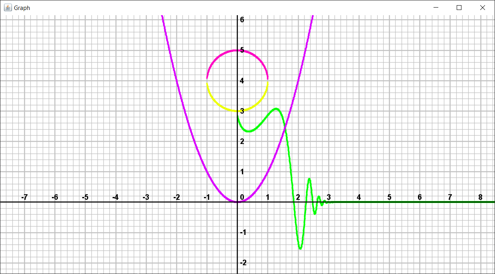

# Graphing Calculator
Simple graphing calculator for swing java.

If you want to use it (for some reason), just add the GraphCoord component to the frame and use lambda expressions to add functions. 

Advantages compared to desmos:
  - you are not limited only to mathematical functions for drawing graphs.
  - you can use any color.
 
Disadvantages compared to desmos:
  - there are just a lot of them, I'm too lazy to list them all. :/
 

